# VPN FCT - Linux
This guide intends to allow the use of FCT's VPN on Linux. Any issues, post them in the issues tab <br/>THANKS: to Miguel, Duda, João and Tiago for early testing of the install and VMs;to João Arvana for making the install process easier, and optimizing this guide;


# Index
1. [Compatibility](#compatibility)
2. [VMs](#vms)
3. [Auto Installation (For Ubuntu based distros)](#auto-installation-for-ubuntu-based-distros)
4. [Auto Installation (For Arch based distros)](#auto-installation-for-arch-based-distros) 
5. [Manual Installation](#manual-installation)
6. [Normal Access](#normal-access)
7. [Uninstallation](#uninstallation)
8. [Known issues](#known-issues)

## Compatibility
 * Tested and working on Ubuntu 16.04 LTS (32 & 64 bits) with Firefox 45 installed
 * Tested and working on Ubuntu 18.04 LTS (64 bits) with Firefox 72 installed
 * Tested and working on Ubuntu 19.10 (64 bits) with Firefox 73 installed
 * Tested and working on Pop!_OS 19.10 (64 bits) with Chrome 80 installed
 * Should work for all Ubuntu distros (Ubuntu, Kubuntu, Lubuntu, Xubuntu, Pop Os!, Elementary OS, Linux Mint, ...)

## VMs 
These VMs contain the VPN already installed, you need Virtual Box to use these, the website is bookmarked on firefox
 * Virtual machine with gcc and java installed (Lubuntu 18.04 32 bits) : https://drive.google.com/file/d/1Hu9sg8IwZ9ZX_jeraHorOeNilWPwPXq6/view?usp=sharing
 * Virtual machine with Eclipse and OCaml installed (Lubuntu 18.04 64 bits): https://drive.google.com/file/d/1BunnK3Sk6bq4ATfK613Z4AArjQ__uObr/view?usp=sharing
 * Virtual machine with Eclipse (Java, C and OCaml) and Visual Studio Code (C) (Lubuntu 18.04 64 bits): https://drive.google.com/file/d/1DkaKP6RnlobPsvSvDfs04h2bTx5lzKZH/view?usp=sharing


## Auto Installation (For Ubuntu based distros)
  Massive thanks to João Arvana for greatly improving this installer and guide.</br>
  Open a terminal window and run the following command:

  ``` 
  wget -O vpn_install.sh https://raw.githubusercontent.com/Diogo-Paulico/FCT-VPN/master/vpn_install.sh && chmod -v +x ./vpn_install.sh && sudo ./vpn_install.sh
  ```

  Follow the instructions on-screen until asked to consult this guide again.

  When you return here follow the Manual Installation from the ["Accepting the SSL certificates"](#accepting-the-ssl-certificates) section onward.

## Auto Installation (For Arch based distros)
Currently Unavailable

## Manual Installation
To install the vpn we are going to be using the terminal, so keep one open at all times during this install. When told to run a command or type into the terminal, type and execute the given command. The terminal can be acessed through the applications menu.

### Java
You need to have Oracle JRE or Oracle OpenJDK installed, to check if it is run the following command:
 ```
  java -version
  ```
  if your output looks anything like this:
  ```
  openjdk version "1.8.0_242"
  OpenJDK Runtime Environment (build 1.8.0_242-8u242-b08-0ubuntu3~19.10-b08)
  OpenJDK 64-Bit Server VM (build 25.242-b08, mixed mode)
  ```
  Java is installed. 
  
  If it looks like this:
  ```
    The program ‘java’ can be found in the following packages:
    * default-jre
    * gcj-4.6-jre-headless
    * openjdk-6-jre-headless
    * gcj-4.5-jre-headless
    * openjdk-7-jre-headless
    Try: sudo apt-get install
```
  Type in the terminal:

  ```
  sudo apt install default-jre
  ```
  Check if it was correctly installed by typing again:
  ```
  java -version
  ```
  The output should now look like the one presented previously.

 ### Firefox
 For some reason you need to have Firefox installed during the VPNs installation even if the browser you intend to use to browse the web is Chrome/Chromium. **Firefox is only required during installation, meaning you can uninstall it right after we are done.** To check if it is installed you can either look for it in the applications menu or type in terminal:

 ```
  firefox
  ```
  if you don't, type:

  ```
  sudo apt install firefox
  ```

### Libraries required by the VPN
 To install them type in the terminal:
 
  ```
  sudo apt install libpam0g:i386 libx11-6:i386 libstdc++6:i386 libstdc++5:i386 libnss3-tools xterm openssl
  ```

### SSL network extender
 To install it you can run the following command:
 ```
 wget -q -O snx_install.sh https://vpn.fct.unl.pt/sslvpn/SNX/INSTALL/snx_install.sh --no-check-certificate && chmod +x ./snx_install.sh && sudo ./snx_install.sh
```
#### or
 Download it from the vpn's website: https://vpn.fct.unl.pt/sslvpn/SNX/INSTALL/snx_install.sh
 <br/>Save it in an easy to reach location (ie. Desktop, Documents, Downloads)
 <br/>Open a terminal window and type:
 ```
  cd ~/(location where it was saved (ie. Documents, Downloads, Desktop)) && sudo bash ./snx_install.sh
```
### cshell
**Firefox needs to be opened at least once after being installed before we can install cshell, so if you have never opened Firefox after installing it please do now and close it rigth after.**

To install it you can run the following command:
```
wget -q -O cshell_install.sh https://vpn.fct.unl.pt/sslvpn/SNX/INSTALL/cshell_install.sh --no-check-certificate && chmod +x ./cshell_install.sh && sudo ./cshell_install.sh
```
#### or
Download it from the vpn's website: https://vpn.fct.unl.pt/sslvpn/SNX/INSTALL/cshell_install.sh
 <br/>Save it in an easy to reach location (ie. Desktop, Documents, Downloads)
 <br/>Open a terminal window and type:
 ```
  cd ~/(location where it was saved (ie. Documents, Downloads, Desktop)) && sudo bash ./cshell_install.sh
```

**If you don't intend to use Firefox as your browser you can now uninstall it!**

### Accepting the SSL certificates
For you to be able to use the VPN you are going to have to accept two SSL certificates, one for localhost (your machine), and another one for the VPN server. Do this on the browser you intend to use to connect to the VPN, normally this would be the browser you use normally.

1. [SSL on Firefox](#ssl-on-firefox)
2. [SSL on Chrome or Chromium](#ssl-on-chrome-or-chromium)

#### SSL on Firefox
* Go to https://localhost:14186/id/
* You should see this 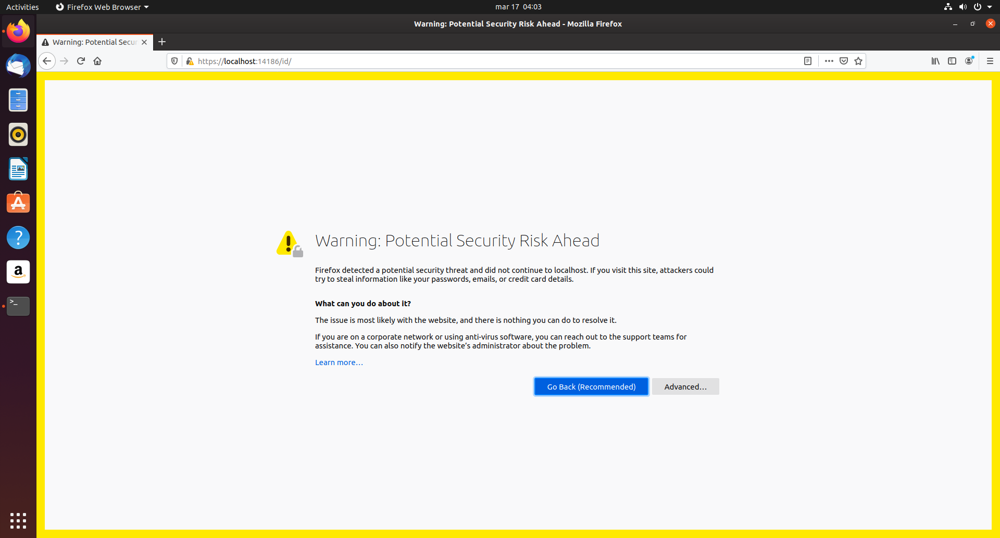
* Now press where the red arrows point to


* You should see a screen with a random string of digits, like shown below (digits have been blured), meaning it is working as intended 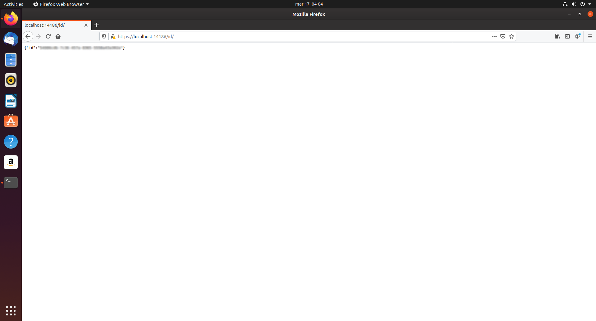

* Now repeat the same steps but on https://vpn.fct.unl.pt/ 
* You should see this screen if successful 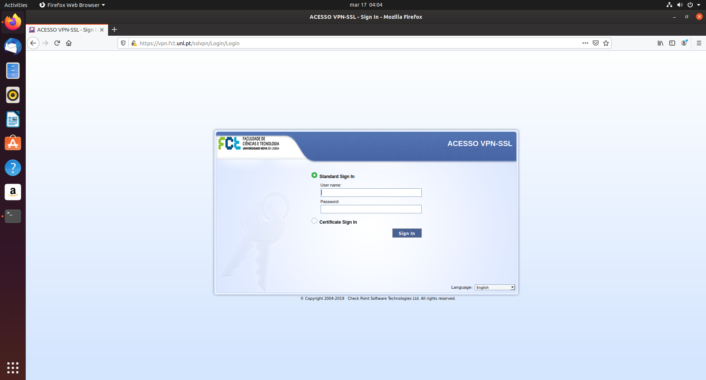

#### SSL on Chrome or Chromium
* Go to https://localhost:14186/id/
* You should see this 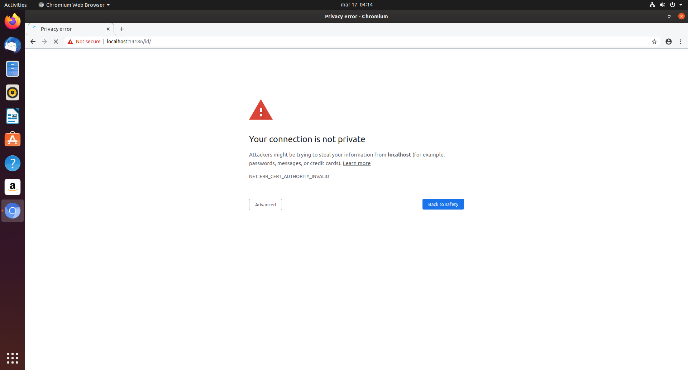
* Now press where the red arrows point to
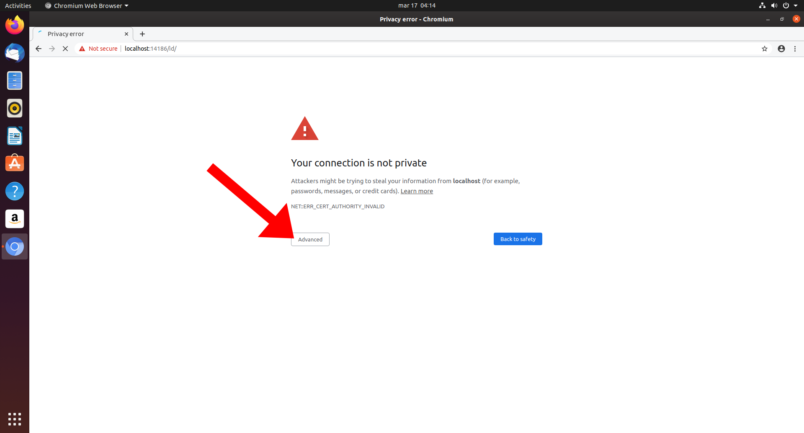
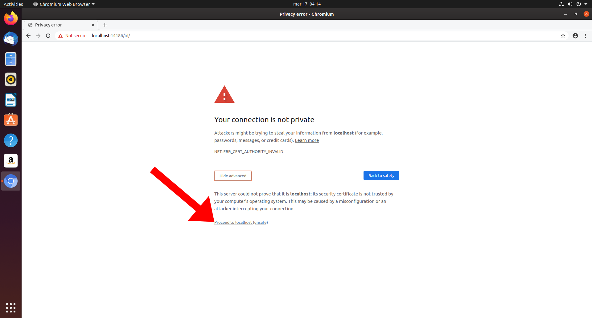
* You should see a screen with a random string of digits, like shown below (digits have been blured), meaning it is working as intended 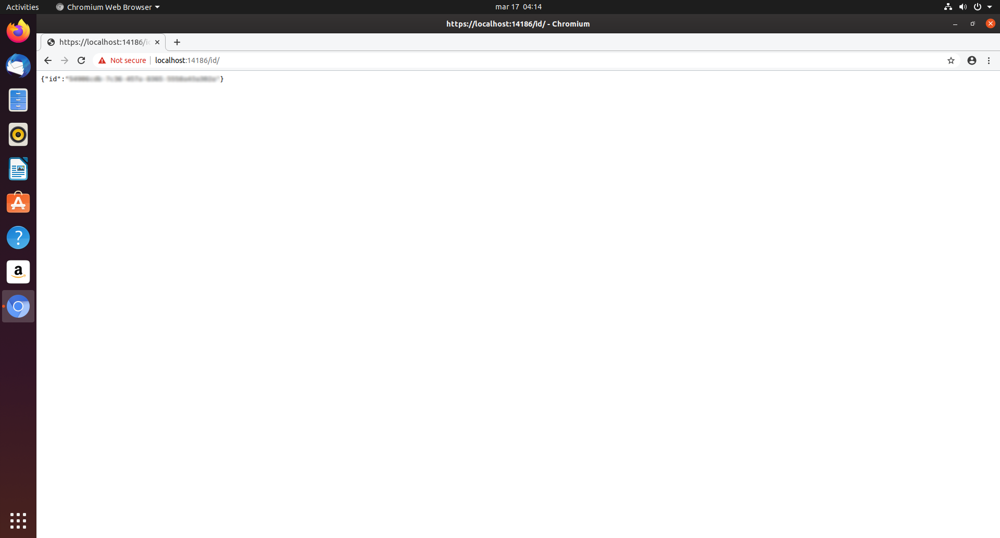

* Now repeat the same steps but on https://vpn.fct.unl.pt/ 
* You should see this screen if successful 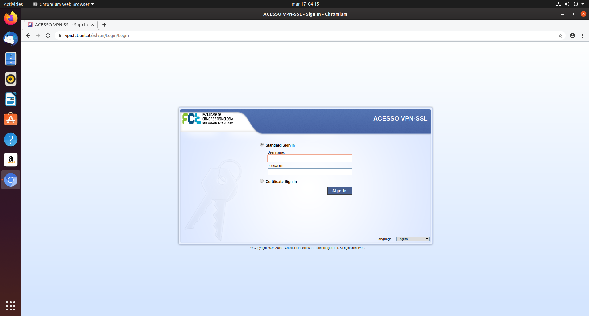

### Connecting for the first time
* Open your browser and go to https://vpn.fct.unl.pt/ , you should see the following page 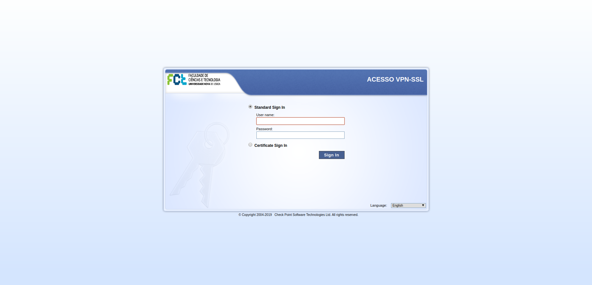
* Sign-in using you CLIP credentials
* You should be brought to this page, where you will be asked to allow popups on the current page, to do this click where the red arrows point
  * Firefox 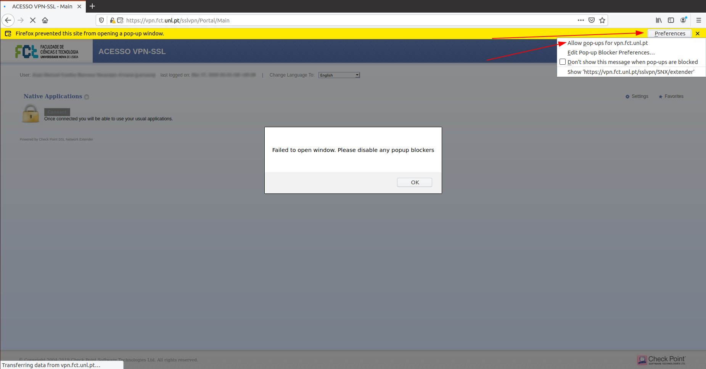
  * Chrome/Chromium 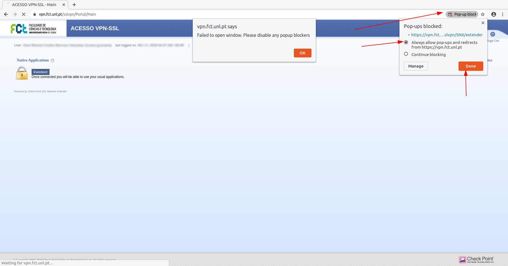
* Now reload the page and this window should popup 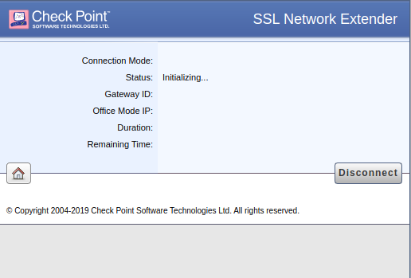
* If it doesn't just click connect on the home page and it should popup 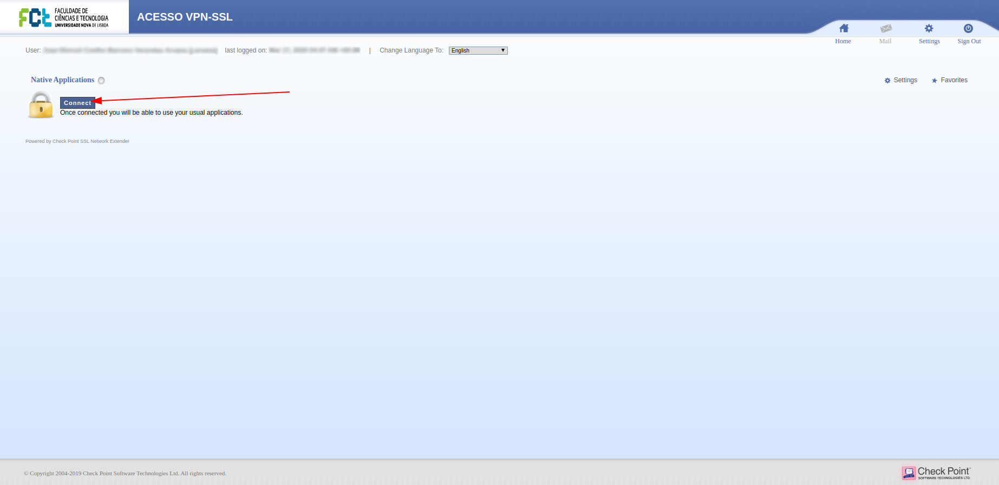
* Next one window should popup, click where the red arrow points, when you do the next window will popup, do the same on that one 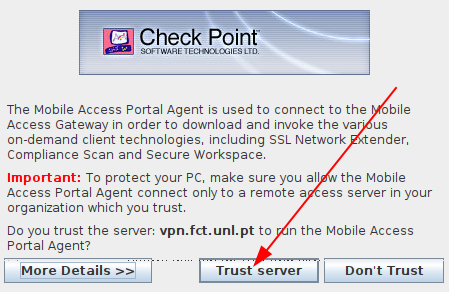 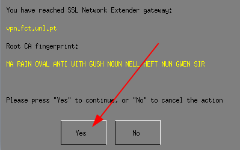
* The first window that popped up should now look like this 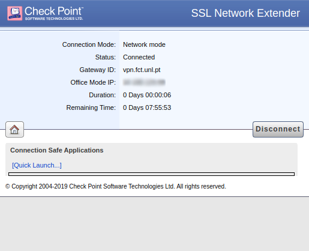

**GOOD JOB YOU'RE NOW CONNECTED**

You can now attempt to access Mooshak:
  * http://mooshak.di.fct.unl.pt/~mooshak/ (This one can take a while to load, it's normal)
  * http://193.136.122.90/~mooshak/

## Normal Access
* Connecting
  * Open your browser and go to https://vpn.fct.unl.pt/
  * Sign-in using your CLIP credentials
  * Wait for the popup, or click <kbd>Connect</kbd> to make it open if it doesn't show up on it's own.
  * Wait for the connection to be established and for Status to change to connected.
* Disconnecting
  * Either click <kbd>Disconnect</kbd> on the home page (the button that is now where <kbd>Connect</kbd> used to be), or click <kbd>Disconnect</kbd> on the popup. Closing the popup also works.


 ## Uninstallation:

 ## Known issues:
  * Can only access Mooshak, none other of the FCT's websites seem to work
